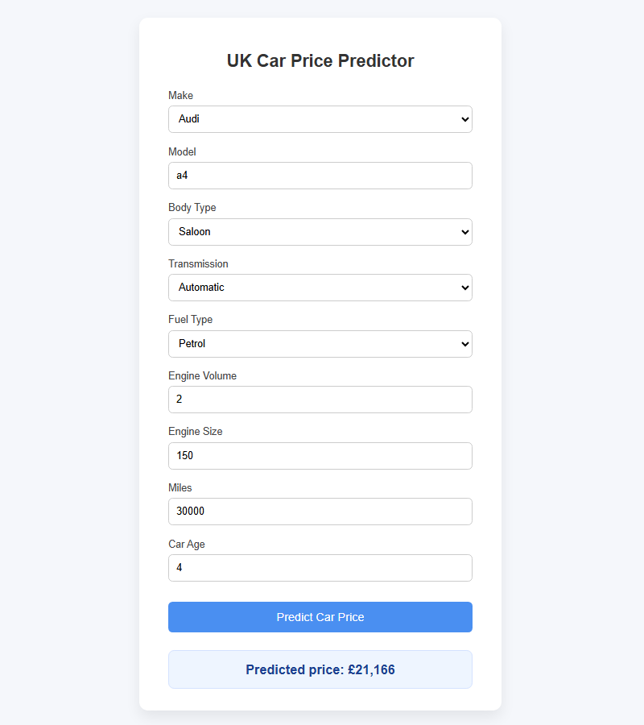

# 🚗 Car Price Predictor (UK Market)

- A machine learning web application that predicts the price of used cars in the UK based on vehicle characteristics such as make, model, body type, transmission type, fuel type, engine volume, engine size, mileage and car age.
- The project demonstrates an end-to-end ML workflow including data preprocessing, model training, testing, optimising and evaluation, pipeline construction and deployment via a Flask web interface.

## 🛠️ Tech Stack

- Python
- Pandas & NumPy (data manipulation)
- Scikit-learn (pipeline construction & preprocessing)
- Linear Regression (baseline)
- XGBoost (final model)
- Flask (web API)
- HTML/CSS (frontend interface)
- JavaScript (frontend interactivity)
- Joblib (model serialisation)

## 🎯 Problem Statement

Pricing used cars accurately is essential for both dealerships and private sellers. The objective of this project is to:
- Predict vehicle prices using structured tabular data
- Compare multiple regression models (e.g., Linear Regression, XGBoost)
- Build a production-ready, reproducible machine learning pipeline
- Deploy the trained model as a user-friendly and intuitive web application

## 📊 Dataset

The original dataset is publicly available on Kaggle ([**here**](https://www.kaggle.com/datasets/guanhaopeng/uk-used-car-market)), it consists of web-scraped UK used car listings with features describing the car, the listing and the car seller's information.

#### 🔑 Key Preprocessing Steps
- Dataset cleaning (dropping unnecessary columns, filling missing values, removing outliers etc.)
- Feature engineering (e.g., combining registration year with reg to extract as many combinations of legitimate rows as possible) 
- Handling categorical encoding
- Feature scaling
- Train/test split with proper validation
- Pipeline-based transformation to prevent data leakage between train and test sets

## 🧠 Modeling Approach

The following regression models were trained, optimised and evalauted:
- Linear Regresssion (baseline model)
- XGBoost

Model performance was evaluated using metrics such as:
- **R² Score** to measure how well the model fits the data compared to a naive mean model
- **Mean Absolute Error (MAE)** represents average error, providing an easily interpretable average GBP error
- **Mean Absolute Percentage Error (MAPE)** providing a scale-independent metric showing average percentage difference between predicted and actual prices (e.g., "model is off by 10% on average")
- **Root Mean Squared Error (RMSE)** showing average magnitude of error in original units (GBP)

All preprocessing and modeling steps were combined into a single scikit-learn pipeline, ensuring reproducibility and preventing data leakage.
The pipeline includes preprocessing (encoding + imputing + scaling) and the trained estimator (XGBoost), ensuring consistent transformations during inference.

## 📈 Model Performance (Test Set)

Final XGBoost model performance:

- **R²:** 0.94
- **MAE:** £1,600
- **RMSE:** £3,900 (inflated by high-end vehicles)
- **MAPE:** 10%

## 🖥️ System Architecture


**1. User Input via Web App:**
User submits car characteristics and attributes through an HTML form.

**2. API Request via Flask:**
Flask receives POST request and extracts input features as a JSON.

**3. Preprocessing Pipeline (scaling + encoding):**
Categorical variables are encoded and numerical features are imputed + scaled using the preprocessing pipeline.

**4. Model Inference (model_pipeline.pkl):**
The trained XGBoost regression model generates a price prediction.

**5. Post-processing:**
The prediction is formatted as GBP currency and rounded for display.

**6. Output via Web App:**
Final predicted price is returned to the user via the HTML template.

## 🌐 Web Application


- The trained model is deployed using Flask.
- Users can input vehicle details via a web interface and receive an instant price prediction (as shown in the example above).

## ▶️ How to Run

**Requirements:** Python 3.11+ recommended

The trained pipeline (models/model_pipeline_v2.pkl) is included for demonstration purposes.

### 1. Clone the repository

```bash 
git clone https://github.com/PiotrM03/car-price-prediction-uk.git
cd car-price-prediction-uk
```

### 2. Create and activate virtual environment (recommended)

##### Windows
```bash
python -m venv venv
venv\Scripts\activate
``` 

##### macOS / Linux
```bash
python3 -m venv venv
source venv/bin/activate
```

### 3. Install dependencies

```bash
pip install -r requirements.txt
```

### 4. Run the app

```bash
python app.py
```

#### If successful, you should see:

```bash
Running on http://127.0.0.1:5000
```

### 5. Open in browser

```bash
http://127.0.0.1:5000/
```

#### (enter the URL that appears in your terminal)